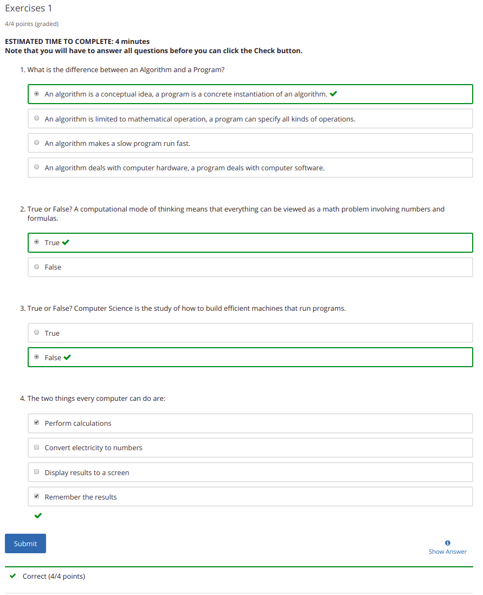
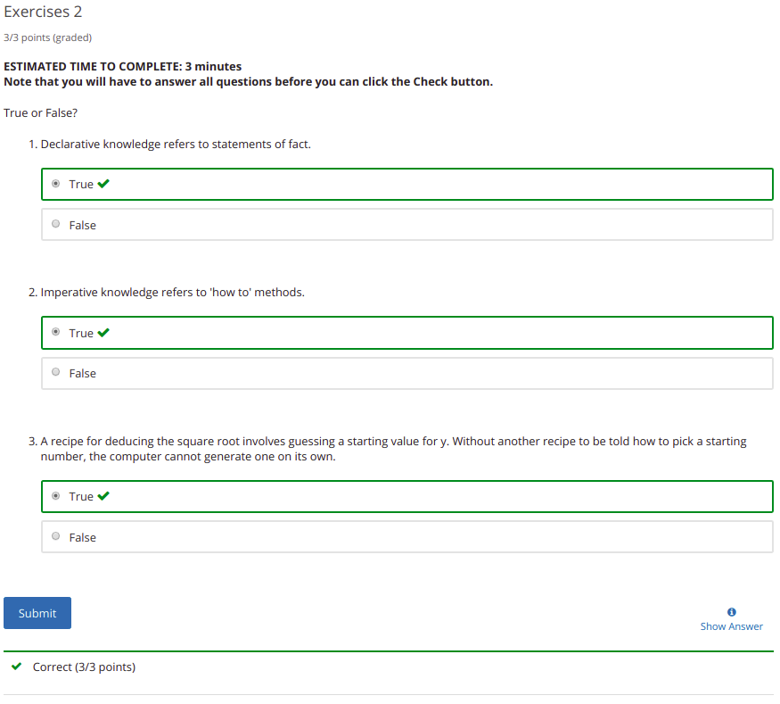

|| **Introduction to Computer Science and Programming Using Python (6.00.1x)** |
|----------------------------------|--------------------:|

Course started: 02/03/2019

## Lecture 1: Introduction

Computational/Algorithmic thinking:

Aim: Think like a computer scientist
How can a computer solve the problem?

- Use simple operations and turn them into something more powerful
- Time taken to complete a computation and size of data are hard limitations that prevent brute forcing being a feasible solution to every problem

*NB* Turing Halting Problem:

From [wikipedia](https://en.wikipedia.org/wiki/Halting_problem)
>In computability theory, the halting problem is the problem of determining, from a description of an arbitrary computer program and an input, whether the program will finish running (i.e., halt) or continue to run forever.

Example of imperative knowledge:

**Heron's Method of solving for the square root:**
>The ancient Babylonians had a nice method of computing square roots
>that can be applied using only simple arithmetic operations.  To find
>a rational approximation for the square root of an integer N, let k 
>be any number such that k^2 is less than N.  Then k is slightly less 
>than the square root of N, and so N/k is slightly greater than the 
>square root of N.  It follows that the average of these two numbers 
>gives an even closer estimate
>                          k + N/k
>                k_new  =  -------
>                             2
>Iterating this formula leads to k values that converge very rapidly
>on the square root of N.  This formula is sometimes attributed to
>Heron of Alexandria, because he described it in his "Metrica", but
>it was evidently known to the Babylonians much earlier.

**Exercises**:

