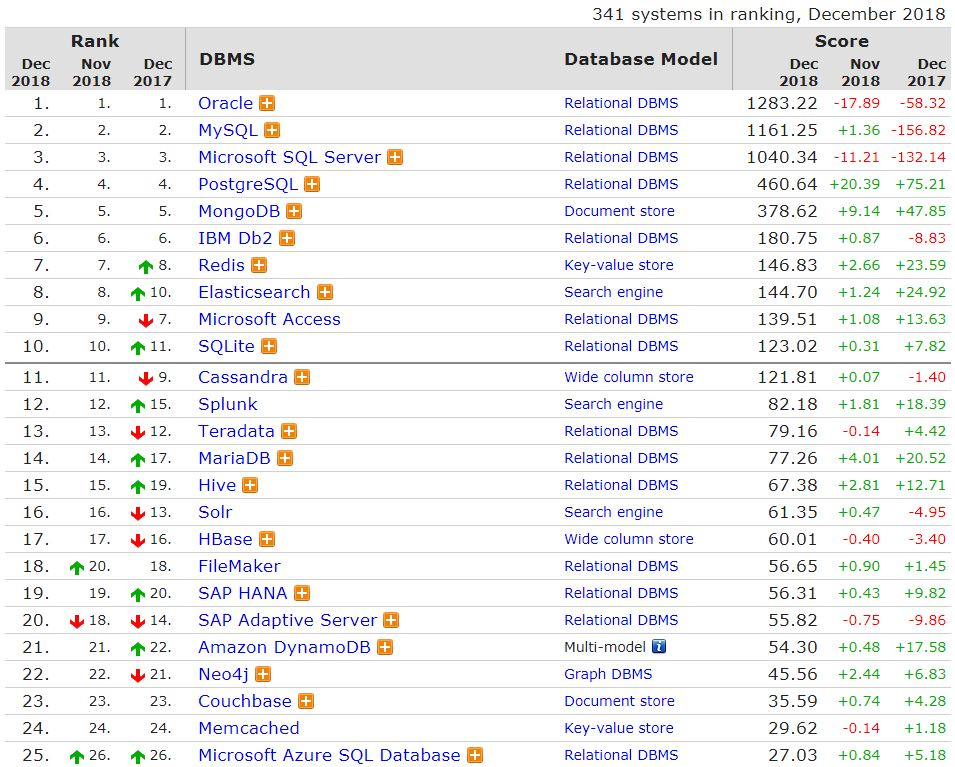

<table border="0">
<tr>
  <td>
    
  </td>
  <td>
    <h1 align="right">
      Database Course
    </h1>
  </td>
</tr>
</table>

Course started: 12/12/2018

## Introduction and Relational Databases (DB1)

### Introduction to Databases

|Term|Definition|
|----|----------|
|[DBMS](https://www.techopedia.com/definition/24361/database-management-systems-dbms)|A database management system (DBMS) is a software package designed to **define, manipulate, retrieve and manage data in a database**|
|[Data concurrency](https://docs.oracle.com/cd/B19306_01/server.102/b14220/consist.htm)|**Many users** can access data **at the same time**|
|[Data consistency](https://docs.oracle.com/cd/B19306_01/server.102/b14220/consist.htm)|Each user sees a **consistent view**of the data, including visible changes made by the user's own transactions and transactions of other users|
|[Declarative Languages](https://www.britannica.com/technology/declarative-language)|Declarative languages, also called nonprocedural or very high level, are programming languages in which (ideally) a **program specifies what is to be done** rather than how to do it.|
|[Schema](https://techterms.com/definition/schema)|A schema is an outline, diagram, or model often used to **describe the structure** of different types of data|

### Types of Databases

### The Relational Model

### Querying Relational Databases

### Introduction to SQL
