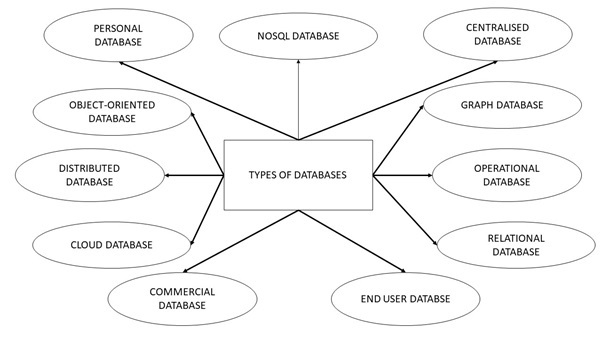
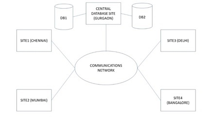
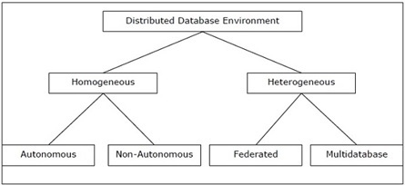
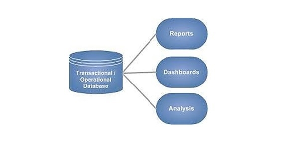
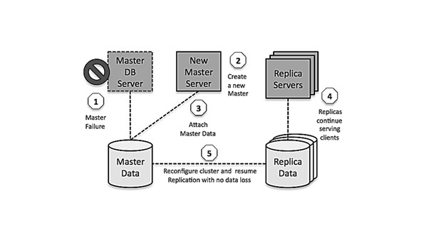
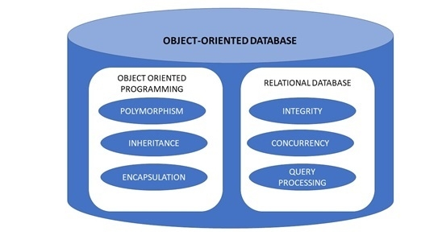
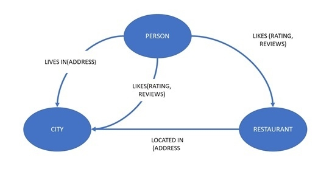

# [Types of databases](https://www.tutorialspoint.com/Types-of-databases "Permalink to Types of databases")

Depending upon the usage requirements, there are following types of databases available in the market:

1. [Centralised database](https://www.tutorialspoint.com/Centralised-database)
2. [Distributed database](https://www.tutorialspoint.com/Distributed-database)
3. [Personal database](https://www.tutorialspoint.com/Personal-database)
4. [End-user database](https://www.tutorialspoint.com/End-User-Database)
5. [Commercial database](https://www.tutorialspoint.com/Commercial-Database)
6. [NoSQL database](https://www.tutorialspoint.com/NoSQL-Databases)
7. [Operational database](https://www.tutorialspoint.com/Operational-Database)
8. [Relational database](https://www.tutorialspoint.com/Relational-Databases)
9. [Cloud database](https://www.tutorialspoint.com/Cloud-Databases)
10. [Object-oriented database](https://www.tutorialspoint.com/Object-Oriented-Databases)
11. [Graph database](https://www.tutorialspoint.com/Graph-Databases)

Let us explain all of them:

#### 1\. Centralised Database

The information(data) is stored at a centralized location and the users from different locations can access this data. This type of database contains application procedures that help the users to access the data even from a remote location.

Various kinds of authentication procedures are applied for the verification and validation of end users, likewise, a registration number is provided by the application procedures which keeps a track and record of data usage. The local area office handles this thing.

#### 2.Distributed Database

Just opposite of the centralized database concept, the distributed database has contributions from the common database as well as the information captured by local computers also. The data is not at one place and is distributed at various sites of an organization. These sites are connected to each other with the help of communication links which helps them to access the distributed data easily.

You can imagine a distributed database as a one in which various portions of a database are stored in multiple different locations(physical) along with the application procedures which are replicated and distributed among various points in a network.

There are two kinds of distributed database, viz. homogenous and heterogeneous. The databases which have same underlying hardware and run over same operating systems and application procedures are known as homogeneous DDB, for eg. All physical locations in a DDB. Whereas, the operating systems, underlying hardware as well as application procedures can be different at various sites of a DDB which is known as heterogeneous DDB.

#### 3.Personal Database

Data is collected and stored on personal computers which is small and easily manageable. The data is generally used by the same department of an organization and is accessed by a small group of people.

#### 4.End User Database

The end user is usually not concerned about the transaction or operations done at various levels and is only aware of the product which may be a software or an application. Therefore, this is a shared database which is specifically designed for the end user, just like different levels' managers. Summary of whole information is collected in this database.

#### 5.Commercial Database

These are the paid versions of the huge databases designed uniquely for the users who want to access the information for help. These databases are subject specific, and one cannot afford to maintain such a huge information. Access to such databases is provided through commercial links.

#### 6.NoSQL Database

These are used for large sets of distributed data. There are some big data performance issues which are effectively handled by relational databases, such kind of issues are easily managed by NoSQL databases. There are very efficient in analyzing large size unstructured data that may be stored at multiple virtual servers of the cloud.

#### 7.Operational Database

Information related to operations of an enterprise is stored inside this database. Functional lines like marketing, employee relations, customer service etc. require such kind of databases.

####  8.Relational Databases 

These databases are categorized by a set of tables where data gets fit into a pre-defined category. The table consists of rows and columns where the column has an entry for data for a specific category and rows contains instance for that data defined according to the category. The Structured Query Language (SQL) is the standard user and application program interface for a relational database.

There are various simple operations that can be applied over the table which makes these databases easier to extend, join two databases with a common relation and modify all existing applications.

#### 9.Cloud Databases

Now a day, data has been specifically getting stored over clouds also known as a virtual environment, either in a hybrid cloud, public or private cloud. A cloud database is a database that has been optimized or built for such a virtualized environment. There are various benefits of a cloud database, some of which are the ability to pay for storage capacity and bandwidth on a per-user basis, and they provide scalability on demand, along with high availability.

A cloud database also gives enterprises the opportunity to support business applications in a software-as-a-service deployment.

#### 10.Object-Oriented Databases

An object-oriented database is a collection of object-oriented programming and relational database. There are various items which are created using object-oriented programming languages like C++, Java which can be stored in relational databases, but object-oriented databases are well-suited for those items.

An object-oriented database is organized around objects rather than actions, and data rather than logic. For example, a multimedia record in a relational database can be a definable data object, as opposed to an alphanumeric value.

#### 11.Graph Databases

The graph is a collection of nodes and edges where each node is used to represent an entity and each edge describes the relationship between entities. A graph-oriented database, or graph database, is a type of NoSQL database that uses graph theory to store, map and query relationships.

Graph databases are basically used for analyzing interconnections. For example, companies might use a graph database to mine data about customers from social media.

